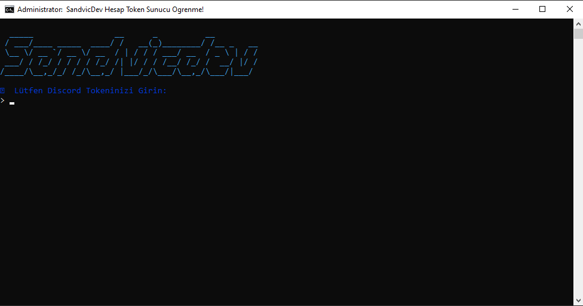
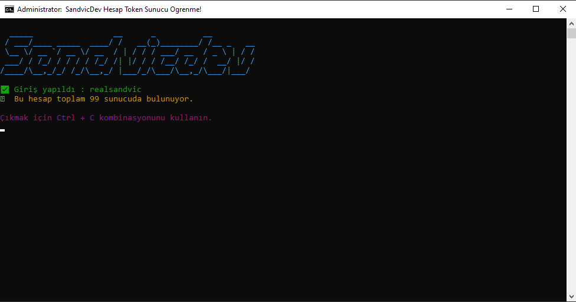

# SandvicDev Sunucu Sayısı Öğrenme Projesi

Bu proje, Discord API'si ile çalışan bir selfbot uygulaması oluşturmanıza olanak tanır. Kullanıcılar, bu botu kendi Discord hesaplarıyla kullanabilirler.

## 🛠️ Kurulum ve Kullanım

### ✨ Adım 1: Modüllerin Yüklenmesi
Projenin çalışabilmesi için gerekli olan modülleri yüklemek için terminal veya komut istemcisinde şu komutu çalıştırın:

```sh
npm install
```

Bu komut, proje için gerekli olan tüm bağımlılıkları yükleyecektir.

---

### 🔐 Adım 2: Tokeninizi Girmek
```sh
1. Discord hesabınızla giriş yapmak için **Discord Tokeninizi** edinmeniz gerekiyor.
2. Uygulama çalıştırıldığında, terminalde tokeninizi girmeniz istenecektir. Tokeninizi doğru şekilde girin.
```

---

### 💪 Adım 3: Botu Başlatmak
Tokeninizi girdikten sonra botunuz otomatik olarak başlatılacak ve giriş yaptıktan sonra hangi sunucularda olduğunuza dair bilgi verecektir.

Botu başlatmak için terminal veya komut istemcisinde şu komutu çalıştırabilirsiniz:

```sh
başlat.bat yada node sandvicdev.js
```

---

### ❌ Adım 4: Botu Durdurmak
Botu durdurmak için terminalde **Ctrl + C** kombinasyonunu kullanabilirsiniz.

---

## 📝 Gereksinimler
Projeyi çalıştırabilmek için aşağıdaki modüllerin yüklü olması gerekir:

```sh
1. discord.js-selfbot-v13 - Discord API'si ile bağlantı kurmak için kullanılan ana kütüphane.
2. readline-sync - Kullanıcıdan girdi almak için kullanılan bir kütüphane.
3. chalk - Konsolda renkli yazı yazmak için kullanılan bir kütüphane.
```

### ⭐ Modülleri Manuel Yüklemek
Proje başlatıldığında `npm install` komutunu çalıştırarak gerekli modüller otomatik olarak yüklenecektir. Eğer manuel olarak yüklemek isterseniz, aşağıdaki komutu kullanabilirsiniz:

```sh
npm install axios chalk discord.js discord.js-selfbot-v13 inquirer readline-sync
```

---

## ⚠️ Önemli Uyarılar
```sh
- Selfbot kullanımı Discord'un Hizmet Şartlarına aykırı olabilir. Bu botu kullanmadan önce riskleri değerlendirin.
- Lütfen bu botu yalnızca kendi hesabınızla kullanın. Başka hesaplara zarar vermek yasaktır ve Discord tarafından yaptırıma neden olabilir.
```

---

### 🤖 Bot Görselleri
<details>
 
 

</details>

---

## 🔵 Discord Profilim
*Ücretli Altyapı, Bot, Kod, Yazılım vb. İçin DM Üzerinden Ulaşabilirsiniz.*

<h2 align="center">
 <a href="https://discord.com/users/754497550483980328"></a>


## 🌐 Kişisel Websitem
Daha fazla proje ve içerik için kişisel web sitemi ziyaret edebilirsiniz:

[🔗 SandvicDev ](https://www.sandvicdev.xyz/)  

---

🌟 **SandvicDev Sunucu Sayısı Öğrenme Projesi** ile iyi eğlenceler! 🚀
